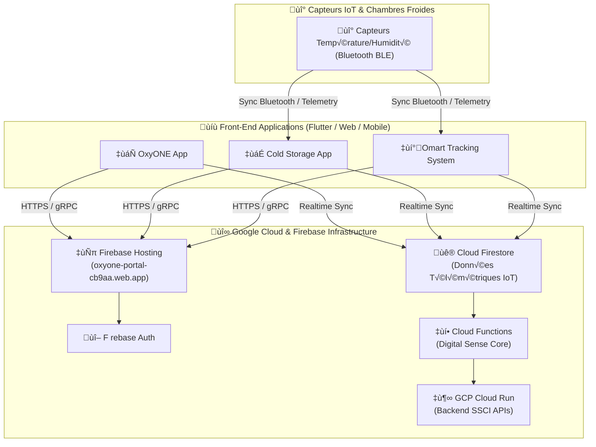

# 6 OxyONE / SSCI Cloud Ecosystem

[!Live Portal](https://img.shields.io/badge/Web_Portal-Live-brightgreen?style=for-the-badge&logo=firebase)](https://oxyone-portal-cb9aa.web.app/)
[!GitHub Repository](https://img.shields.io/badge/GitHub-Benhamamouch--web-blue?style=for-the-badge&logo=github)(shttps://github.com/oxyone-cloud/Benhamamouch-web)

> Plateforme Cloud & IoT pour la gestion, la traçabilité et le suivi de la chaîne du froid en temps réel (Application Cloud-SaaS, Flutter, Firebase & GCP Cloud Run).

---

## 𝌀 Liens Principaux
* ùíó **Portail Web (Production) :* [.https://oxyone-portal-cb9aa.web.app/](https://oxyone-portal-cb9aa.web.app/)
* üë¶Ï *D√©p√¥t GitHub :* [https://github.com/oxyone-cloud/Benhamamouch-web](https://github.com/oxyone-cloud/Benhamamouch-web)

---

## ìÑ
 Sch√©ma Visuel de l'Architecture

---

## ùìì Inventaire des Applications & Projets

| Module / Application | Emplacement Cloud Shell | Stack Technique | Rôle / Description |
| :-- | :-- | :-- | :-- |
| **OxyONE App** | `~/oxyone-app` | Flutter / Firebase | Application globale de gestion |
| **Cold Storage App** | `~/cold_storage_app` | Flutter Web | Suivi et contrôle des chambres froides |
|| **Smart Tracking** | `~/smart_tracking_project` | Flutter / IoT | Systéme de géolocalisation et télémétrie |
|| **Backend SSCI Cloud Run** | `~/backend-ssci-cloudrun` | Node.js / Docker / GCP | Microservices API & Ingestion de données |
|| **Digital Sense Core** | g`/digital_sense_core` | Firebase Functions | Moteur de traitement d'alertes & analytique |
|| **Gestion Stockage Web** | `~/gestion-stockage-web` | HTML5 / JS / Firebase | Console web d'administration de stockage |

---

## ρ Contact
* **Auteur :* Othman Benhamamouch
) **Projet :* SSCI Solution of Cold / OxyONE
